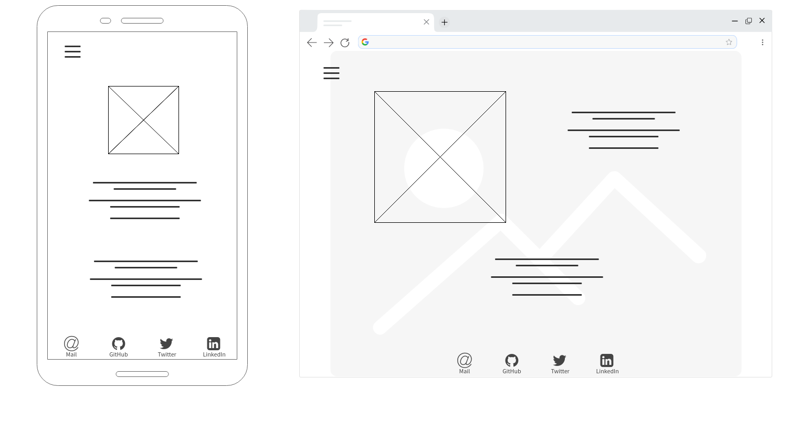

# Portfolio of Tony Huynh
Link to Portfolio Website: https://t-hnh10.github.io
Link to GitHub Repository: https://github.com/t-hnh10/t-hnh10.github.io
## Description
### Purpose
The purpose of this portfolio is to demonstrate my abilities as a developer to prospective employers.
### Functionality
The website consists of a multi-page format where topics are divided into separate pages. Users are welcomed to the index page which acts as the homepage. Through the use of a hamburger menu, users may open up the navigation bar from the left-hand side of the screen. From this bar, other pages of the website are easily accessible.
### Sitemap

### Screenshots
Several screenshots demonstrating responsive design can be found below:

### Target audience
As stated above, the target audience is prospective employers to whom I am showcasing my talent, abilities and coding experience.
### Tech Stack
This website was coded from Visual Studio Code in HTML and CSS. Sass was employed as a CSS compiler to maximise the efficiency of the CSS coding process. The deployment platform is GitHub Pages which automatically deploys the website from the repository.
## Design Documentation
### Design process
The design process consisted of the following:
1. Moodboarding —  *Milanote* was used to gather various design elements. These included images, colours and fonts. Together, these elements formed the basis of the website's design inspiration.
2. Wireframes — *Mockflow* was used to design the site interface. Mobile and desktop interfaces were created with responsive design in mind.
#### Moodboard

#### Wireframes
Index Page

About Page

Projects Page

#### Usability considerations
Usability was one of the primary considerations in designing this website.

In order to facilitate simple navigation, a minimalist design was used. This meant that the interface is marked by clarity and purpose. There are no superfluous or unnecessary elements unless they provided some form of visual feedback to the user which may add to the overall experience.

The navigation bar is hidden under the hamburger menu which slides from the left of the screen when called upon. This assisted in keeping the minimalist design where the interface is kept as clean and simple as possible. When required, the navigation bar will overlap the screen to provide the user with options.

Contact details and social media links are placed in the footer. This was designed with mobile devices in mind, as elements towards the bottom of the screen are easier to reach on touchscreens. However, the footer does not impede upon the interface when the contents overflow the viewport. This ensures that space on the viewport is not wasted and cluttered.
## Details of planning process including
Timeline

Trello Board

## Short Answer Q&A
- Describe key events in the development of the internet from the 1980s to today (max. 150 words)
  - **1982**: Transmission Control Protocol (TCP) and Internet Protocol (IP) emerge as the protocol for ARPANET.
  - **1983**: The Domain Name System (DNS) establishes the familiar system for naming websites.
  - **1986**: The NSFNET goes online to connected supercomputer centers.
  - **1990**: Tim Berners-Lee develops HyperText Markup Language (HTML). 
  - **1991**: CERN introduces the World Wide Web to the public.
  - **1998**: The Google search engine is born. Internet Protocol version 6 is also introduced, allowing for future growth of internet addresses.
  - **2000**: The dot-com bubble bursts. The vulnerability of the Internet is realised after large-scale denial of service attacks.
- Define and describes the relationship between fundamental aspects of the internet such as: domains, web servers, DNS, and web browsers (max. 150 words)
  - A web server is a program which uses HTTP to serve content that form web pages. Such web pages are accessible by domain names. These are labels that identify a network domain. Because domain names are easy to read, they essentially act as an intermediary between humans and said network domains. The Domain Name System (DNS) acts as a phonebook of the internet, converting domain names to IP addresses. Web browsers interact through IP addresses to then load internet resources.
- Reflect on one aspect of the development of internet technologies and how it has contributed to the world today (max. 150 words)
  - The development of email has had an immense impact on essentially every person in the world. With standards being published as early as 1973, it has played an important role in the development of the internet in both a business and personal sense.
  - In business, email has facilitated logistics in operations that could not have been possible without it. Transactions are regularly discussed and agreed upon through the use of email, even being legally binding just as a physical document can be. It has helped businesses reduce cost in postage and increase productivity by increasing speed of communication.
  - Regarding personal use, email was once the most convenient form of communication with those in distant places. It allowed people to save on postage costs of letters and expensive phone calls. As a predecessor to instant messaging, it remains an important part of the development of the internet and specifically communication.